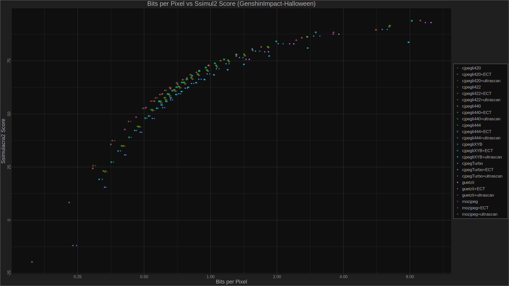
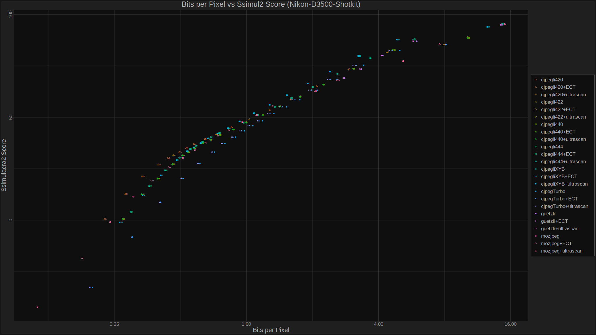
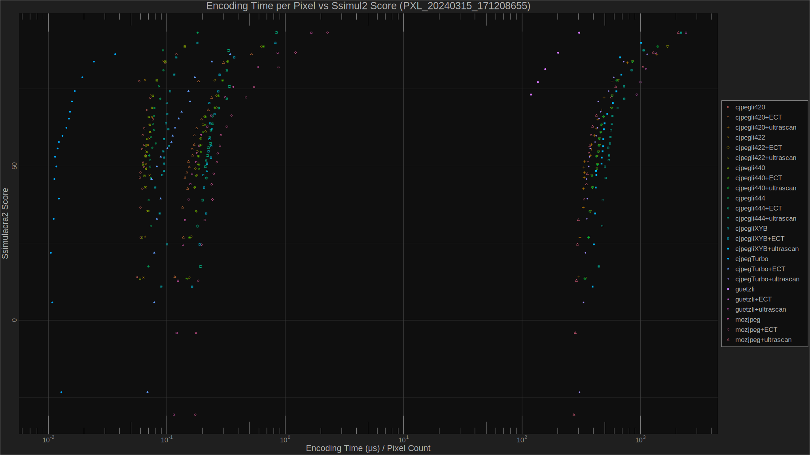

# JPG encoders + optimizers benchmark
## Encoders
- `cjpegli` cjxl v0.10.2 8928c7a [AVX2,SSE4,SSE2]
- `guetzli` 1.0.1-4  (Arch extra repo)
- `libjpeg-turbo` version 3.0.2 (build 20240125)
- `mozjpeg` version 4.1.5 (build 20240322)

## Optimizers
- `ect` 0.9.5 compiled on Jan 13 2024 ([source](https://github.com/fhanau/Efficient-Compression-Tool/))
- `jpegultrascan.pl` 1.4.0 2024-04-19 ([source](https://encode.su/threads/2489-jpegultrascan-an-exhaustive-JPEG-scan-optimizer))

## Quality metric
`ssimulacra2` from libjxl repo (cjxl v0.10.2 8928c7a [AVX2,SSE4,SSE2])

## Some graphs
Note that these graphs were created by Orum (also known as `maynguene_banana`). A **huge thank** to him!

For more graphs (comparing each of the 7 images: BPP - Bits Per Pixel, SSIM2, Encode time), see [here](results/svg).

## Conclusions

"Unfortunately" optimizing the JPG does not change the encoder to choose for the best ratio bpp/ssim2. I've seen much higher size reduction for JPGs found on the Internet (up to 15% quite easily), but it is quite small with this benchmark.

It is quite safe to say "**always use `cjpegli` 420 for BPP < 1** (surprisingly followed really close by mozjpeg), **otherwise `cjpegli` 444**", jpeg-turbo indeed is fast but who can *not* bear sub-second encode time with cjpegli...

There a little exception here: the konosuba is quite an unusual image with lots of colors (and difficult to compress). For that one, the winner is `cjpegli` once again but with 444 as chroma subsampling. I love that one.

XYB seems to be the one to use for colorful images (and by "far") (LOLZA and konosuba), and for real-life photos.\
Surprinsingly it is the worst one for the Genshin Impact image.\
It can provide better quality/size ratio, but many viewers don't support ICC profiles.

Remember that we are simply using a metric to compare automatically images (and some differences in SSIM2 qualities are negligible).\
The best way to compare is to use our eyes!\
I think (but that's my choice) I will stick with the default jpegli 444, or sometimes 420

**ECT optimization is definitely worth it**, as it is almost instantaneous.\
Scans bruteforcing (`jpegultrascan.pl`) is only for people (like me) worrying about maximum compression at the cost of really slow speed - note that since it's bruteforcing, it can be done using several threads (for this benchmark I used only 1 thread per encode).
